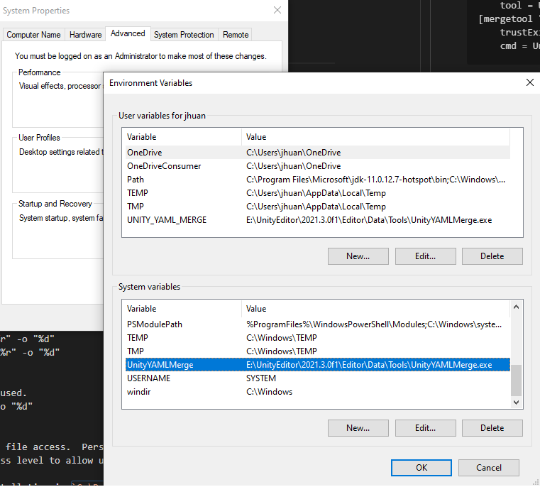
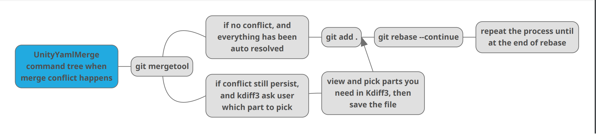

# UnityYamlMerge Tool Demostration 2023 (中文教程在下面 - Chinese tutorial is down below)

# Why this matter to you?
You are trying to edit a Unity3d project with others, that you or others are both editing a scene object or a prefab object in unity, this causes merge conflict that's insane for human to read.  Here's a solution that may work for you!

# Pre-requisite

Pre-requisite: In unity3d project make sure you you have the following set in Unity Editor -> Edit -> Project Settings -> Under Asset Serialization: Mode -> "force text" set

## Part 1: The Setup
The demostration is done on windows environment, you can chceck reference to other system via here: https://docs.unity3d.com/Manual/SmartMerge.html


And in the version control have "Visible Meta Files" option set


UnityYamlMerge tool comes as a default tool with Unity Editor, you can find it in the Unity's Editor file path at `Editor/Data/Tools`



First add the `UnityYamlMerge` environment variable with value of where `UnityYamlMerge.exe` is located on your local machine as image shown above.

In "C:\user\<user>\.gitconfig" add the following:

```
[merge]
    tool = UnityYAMLMerge
[mergetool "UnityYAMLMerge"]
    trustExitCode = false
    cmd = UnityYAMLMerge merge -p "$BASE" "$REMOTE" "$LOCAL" "$MERGED"
```

The above tells git that you are going to use UnityYamlMerge tool as the mergetool to resolve conflict.

Note that you still needs to setup a windows environment variable for `UnityYamlMerge` with value indicating where the tool is installed.

On windows system when we use git, usually we have git-scm installed, that comes with a Mingw64 command line system, therefore we need to add the following in git bash's `path` environment variable:
```
export UNITYYAMLMERGE="/e/UnityEditor/2021.3.0f1/Editor/Data/Tools/UnityYAMLMerge.exe" && export PATH=$PATH:$UNITYYAMLMERGE
```
Note that `/e/UnityEditor/2021.3.0f1/Editor/Data/Tools/UnityYAMLMerge.exe` should be modified to your own `UnityYamlMerge.exe`'s local path on your system.

Lastly, in your unity editor installation path we need to modify the mergespecfile.txt. `E:\UnityEditor\2021.3.0f1\Editor\Data\Tools\mergespecfile.txt` Make sure to replace the first part to your local path to unity editor.

We need to add the following code block on the top of the file, what this does is it would de fine what diff viewer to use for different file, the first 2 line specify uses `kdiff3.exe`  for `unity` and `prefab` files.  The default fall back is a `*` to represent all files that have not been caught be definition above this line to use `kdiff3.exe` as well.

```
unity use "C:\Program Files\KDiff3\kdiff3.exe" "%b" "%l" "%r" -o "%d"
prefab use "C:\Program Files\KDiff3\kdiff3.exe" "%b" "%l" "%r" -o "%d"

#
# Default fallbacks for unknown files. First tool found is used.
* use "C:\Program Files\KDiff3\kdiff3.exe" "%b" "%l" "%r" -o "%d"
```

Note that when changing this file, it might have issue with file access.  Personally I am using visual studio code, I had no issue, but friend had to change file and folder access level to allow user to edit with a default text editor.

Please also note that default location for `kdiff3.exe` installation is `C:\Program Files\KDiff3`
If you don't have kdiff3 installed you can find it at https://sourceforge.net/projects/kdiff3/

## Part 2: Merge conflict? How to resolve with UnityYamlMerge tool?

What to do on the command line to use this tool?

When merge conflict happens, I usually update main branch first, then I rebase main into my feature branch I am working on. Then I use the following commands in sequence:



`git status` to confirm I am on the feature branch

`git mergetool` to start the UnityYamlMerge tool to let it do the magic

At this point, the mergetool has done it's job

Now I run `git status` then `git mergetool` again it would show nothing to merged.

Finally uses `git add .` to tell git we are done resolve  conflict on the files.

Back to `git rebase --continue` hooray we are now done once after you finish the rebase, force push to your remote repo.

Everything is fine again!


# UnityYamlMerge Tool 工具展示 2023

# 为什么这对你重要？
因为你和你的朋友可能一起在修改该一个Unity3d的场景文件或者Prefab文件，这个时候他可能造成文件合并冲突，不是人能够看懂的那种！那么UnityYamlMerge工具就是你最亲爱的伙伴与朋友，您值得用它一试。

# 初步要求
在Unity3D编辑器的 Edit -> Project Settings -> Under Asset Serialization: Mode -> "force text" 

然后在Version Control里面选择 "Visible Meta Files" 选项

## 步骤 1: 安装
这是在windows平台的展示，其他平台的具体操作可以参考: https://docs.unity3d.com/Manual/SmartMerge.html


UnityYamlMerge工具是Unity3d自带的辅助工具你可以在Unity Editor的安装目录的 `Editor/Data/Tools`子目录下面找到他


首先我们需要把`UnityYamlMerge`函数加入系统的环境函数里面，参数数值是`UnityYamlMerge.exe`在您机器上的路径

然后在 "C:\user\<用户名>\.gitconfig" 加入如下的代码，这是设置git让他使用UnityYamlMerge tool来解决合并冲突:

```
[merge]
    tool = UnityYAMLMerge
[mergetool "UnityYAMLMerge"]
    trustExitCode = false
    cmd = UnityYAMLMerge merge -p "$BASE" "$REMOTE" "$LOCAL" "$MERGED"
```

在windows平台使用git的话，我们通常是用的git-scm所以你需要在git-scm自带的Mingw64系统中也加入UnityYamlMerge工具的路径，方式如下：
```
export UNITYYAMLMERGE="/e/UnityEditor/2021.3.0f1/Editor/Data/Tools/UnityYAMLMerge.exe" && export PATH=$PATH:$UNITYYAMLMERGE
```

请注意 `/e/UnityEditor/2021.3.0f1/Editor/Data/Tools/UnityYAMLMerge.exe` 应该是你本地的 `UnityYamlMerge.exe` 路径

最后我们需要修改 mergespecfile.txt文件， 他的地址在`E:\UnityEditor\2021.3.0f1\Editor\Data\Tools\mergespecfile.txt` 请替换成你本地的安装路径找到这个文件

这一步的作用是让 `kdiff3.exe`  来选取 `unity` 和 `prefab` 文件中的合并冲突处理，也让任何没有单独设置的文件用它来做合并处理

```
unity use "C:\Program Files\KDiff3\kdiff3.exe" "%b" "%l" "%r" -o "%d"
prefab use "C:\Program Files\KDiff3\kdiff3.exe" "%b" "%l" "%r" -o "%d"

#
# Default fallbacks for unknown files. First tool found is used.
* use "C:\Program Files\KDiff3\kdiff3.exe" "%b" "%l" "%r" -o "%d"
```

请注意这一步可能会涉及到修改这个文件的时候没有权限，请改变文件夹和文件的权限你就可以修改它，我本人用的VS code,完全没问题。

 `kdiff3.exe` 的默认安装路径是 `C:\Program Files\KDiff3`
如果你在机器上找不到他的话，请去 https://sourceforge.net/projects/kdiff3/按装Kdiff3

## 步骤 2: 合并冲突? 怎么用UnityYamlMerge工具来解决合并冲突?

怎么在命令行使用这个呢？

当冲突发生的时候，我通常用git rebase ，把main/master的分支，主分支rebase到我当前工作的分支中:


`git status` 来看下我在正确的分支中

`git mergetool` 会启动这个UnityYamlMerge工具来让他的魔法合并我们的unity场景文件冲突

当到这里的时候，通常你的合并冲突已经被处理好了

我会在跑一遍这两个命令 `git status`  `git mergetool` 确认冲突已经搞定。
然后`git add .` 来告诉git我已经处理好了合并冲突。

最后用`git rebase --continue` 来完成这个rebase

哇，到这里我们就处理完这个头疼的问题了！
